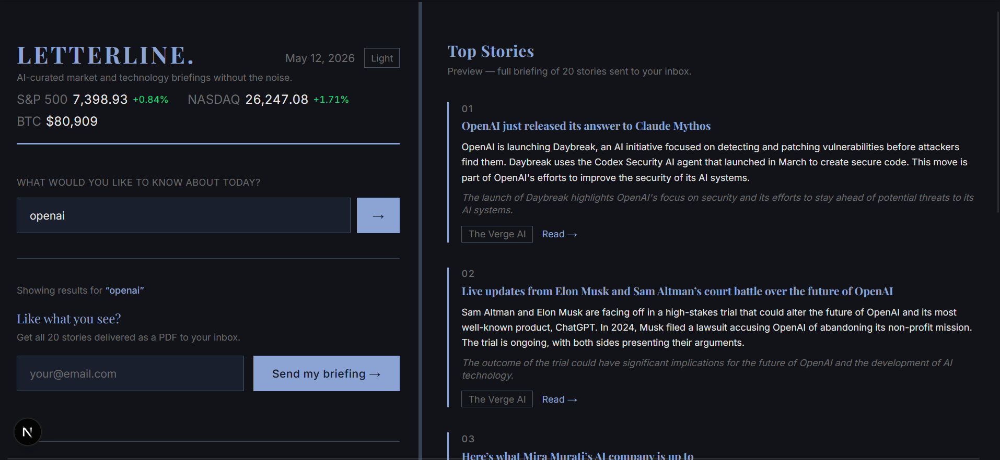
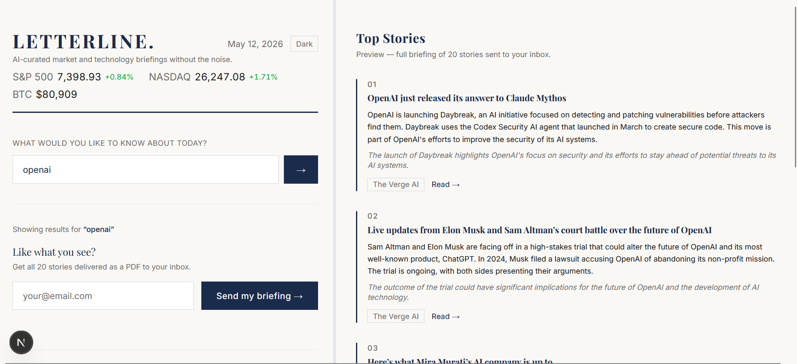
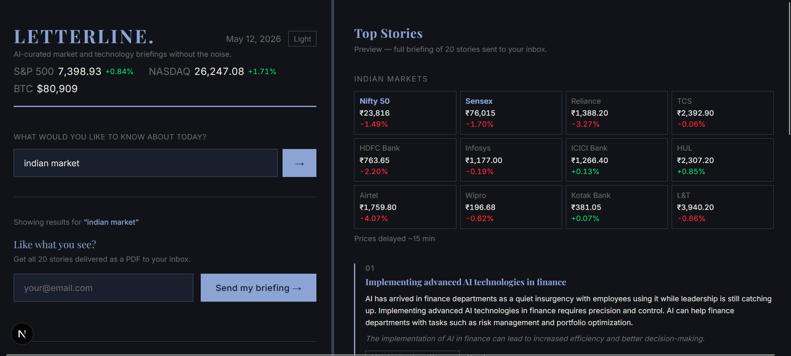

# Letterline

**AI-curated market and technology briefings without the noise.**

Letterline is a smart news aggregator focused on AI and finance. Enter a topic — or browse by market — and get a live preview of the top 5 stories, curated and summarized by a large language model. Request a full 20-story briefing delivered as a PDF to your inbox.

> **Status:** Not yet live. Deployment coming soon.

---

## About

Most news aggregators drown you in volume. Letterline does the opposite — it reads everything so you don't have to, then surfaces only what's worth your time.

The idea is simple: you tell it what you care about (or don't — broad AI + Finance coverage works too), and it pulls from 15+ publications, runs the stories through a language model, and hands you back a clean, ranked briefing. No ads, no algorithmic engagement traps, no 47-tab rabbit holes. Just signal.

The full briefing lands as a PDF in your inbox — formatted like a proper newsletter, not a data dump. It's built for people who want to stay sharp on AI and markets without spending their morning scrolling.

Built as a personal project at the intersection of two things worth paying attention to: large language models and financial markets.

---

## Screenshots

**Dark mode — topic search with live story preview**


**Light mode**


**Indian market data widget**


<!-- Add a demo video or GIF here -->
<!-- Example:  -->

---

## Features

- **Topic-based curation** — Enter any topic (AI agents, crypto markets, India stocks, NLP, etc.) and get stories relevant to it
- **Live streaming preview** — Top 5 stories stream in real time as the LLM processes them
- **Market data widgets** — Detects US or India market queries and shows live stock/index prices
- **Full briefing by email** — 20-story PDF briefing sent directly to your inbox via Resend
- **Dark mode** — System-aware with manual toggle, persisted across sessions
- **Resizable split panel** — Drag to resize the topic panel and stories panel
- **15+ sources** — Pulls from TechCrunch, Wired, MIT Tech Review, VentureBeat, Reuters, Bloomberg, CoinDesk, Economic Times, Business Standard, and more
- **Rate limiting** — Built-in per-IP rate limiting (3 requests/hour)

---

## Tech Stack

| Layer | Technology |
|---|---|
| Framework | Next.js 15 (App Router) |
| Styling | Tailwind CSS v4 |
| LLM | Groq API — Llama 3.3 70B |
| News sources | RSS via `rss-parser`, Algolia HN API, arXiv API |
| PDF generation | `@react-pdf/renderer` v4 |
| Email delivery | Resend |
| Market data | Yahoo Finance v8 API, Coinbase API |
| Deployment | Vercel (planned) |

---

## Getting Started

### 1. Clone the repo

```bash
git clone https://github.com/xHydr1dex/Letterline.git
cd Letterline
```

### 2. Install dependencies

```bash
npm install
```

### 3. Set up environment variables

Create a `.env.local` file in the root:

```env
GROQ_API_KEY=your_groq_api_key
RESEND_API_KEY=your_resend_api_key
RESEND_FROM=you@yourdomain.com
```

- **Groq API key** — Get one free at [console.groq.com](https://console.groq.com)
- **Resend API key** — Get one at [resend.com](https://resend.com). Free tier works for testing (verified sender email only)
- **RESEND_FROM** — Must match a verified sender in your Resend account

### 4. Run the development server

```bash
npm run dev
```

Open [http://localhost:3000](http://localhost:3000).

---

## How It Works

1. **User enters a topic** (or leaves blank for broad AI + Finance coverage)
2. **15+ RSS feeds are fetched** and deduplicated
3. **Groq (Llama 3.3 70B) streams a response** — top 5 stories as newline-delimited JSON
4. **Stories render in real time** in the right panel
5. **User enters their email** to receive the full 20-story PDF
6. **PDF is generated server-side** with `@react-pdf/renderer` and sent via Resend using Next.js `after()` for non-blocking background delivery

### Market detection

If the topic contains keywords like `nifty`, `sensex`, `bse`, `india` → Indian market widget loads.
If the topic contains `s&p`, `nasdaq`, `dow`, `us market` → US market widget loads.

---

## Project Structure

```
briefly/
├── app/
│   ├── page.tsx              # Main single-page UI
│   ├── layout.tsx            # Root layout with dark mode script
│   ├── globals.css           # Tailwind v4 theme + dark mode
│   └── api/
│       ├── preview/          # Streaming Groq endpoint
│       ├── email/            # PDF generation + Resend
│       ├── stocks/           # Yahoo Finance stock data
│       └── market/           # S&P 500, Nasdaq, BTC strip
├── components/
│   ├── Masthead.tsx          # Header with date + theme toggle
│   ├── MarketStrip.tsx       # Top ticker bar
│   ├── StockGrid.tsx         # 4×3 stock grid (US or India)
│   └── ThemeToggle.tsx       # Light/dark toggle button
├── lib/
│   ├── sources.ts            # RSS feed URLs
│   ├── fetchNews.ts          # RSS fetcher + formatter
│   ├── buildPrompt.ts        # Groq prompt builders
│   ├── generatePdf.ts        # PDF layout with react-pdf
│   └── rateLimit.ts          # In-memory IP rate limiter
└── .env.local                # API keys (not committed)
```

---

## Deployment (Planned — Vercel)

1. Push to GitHub (this repo)
2. Import into [vercel.com](https://vercel.com)
3. Add environment variables in Vercel dashboard
4. Deploy

The app uses `runtime = 'nodejs'` on API routes to support PDF generation and streaming. No database required.

---

## Roadmap

- [ ] Vercel deployment + custom domain
- [ ] Mobile-responsive layout
- [ ] Scheduled daily email digest
- [ ] More source categories (policy, science, macro)
- [ ] Story deduplication across sources
- [ ] User-defined topic presets

---

## Sources

Letterline aggregates from 15+ publications including:

TechCrunch · Wired · MIT Technology Review · VentureBeat · The Verge · Ars Technica · Reuters Business · Bloomberg Technology · CoinDesk · Hacker News · arXiv (cs.AI) · Economic Times Markets · Economic Times Economy · Business Standard · Financial Express

---

## License

MIT
